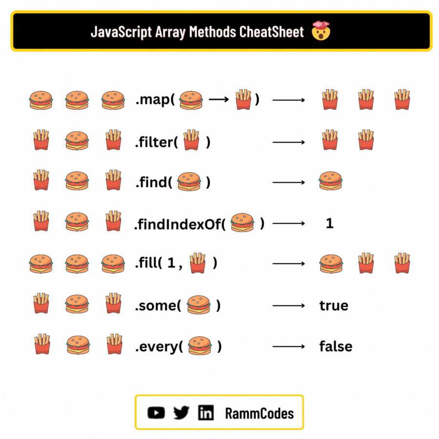

# Introduction
* Voir les tendances des frameworks JS existants : [State Of Js](https://2024.stateofjs.com/en-US/libraries/front-end-frameworks/)
* Rappel fonctions tableaux en JS


# React
[Documentation officielle](https://fr.react.dev/)

## Créer son premier projet
* Installer [NodeJs](https://nodejs.org/fr) (version LTS)
* Créer un projet avec Vite :
```
npm create vite@latest
```
> Accepter l'installation de create-vite

> Selectionner un nom de projet > Selectionner React > Selectionner JS

## Lancer le serveur
Si première fois, il faudra installer les packages 
```
npm i(nstall)
```

```
npm run dev
```

## Architecture du projet
--**node-modules** (ne pas toucher -> dépendances du projet)\
--**public** (médias publiques)\
--**src**\
|---**assets** (médias pour l'app)\
|---**App.css** (fichier css créé pour le composant App)\
|---**App.jsx** (composant contenant votre application)\
|---**index.css** (style global à toute l'application)\
|---**main.jsx** (script de démarrage -> celui qui charge App)\
--**.gitignore** (fichier créé spécifiquement pour react)\
--**index.html** (LE fichier html lancé au démarrage)\ 
--**package.json** (fichier où sont listées les dépendances du projet)\
--**vite.config.js** (config de vite)
